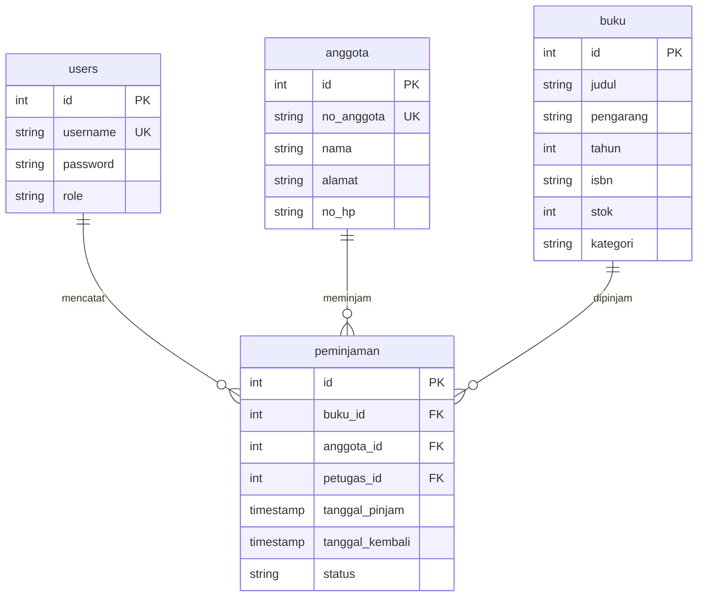

# SIMPUS-Mini — Jobsheet 12

Aplikasi perpustakaan sederhana (HTML5, CSS3, JavaScript, PHP native, PostgreSQL/PDO_PGSQL).
Jobsheet 12 melengkapi modul **Peminjaman & Pengembalian** dan menyatukan semua modul sebelumnya.

## Fitur

| Peran | Bisa melakukan |
|---|---|
| Tamu | Melihat Beranda (statistik real) dan Katalog buku (cari, filter kategori, status stok) |
| Petugas | Semua fitur Tamu, ditambah CRUD Buku, CRUD Anggota (kecuali hapus), pinjamkan buku, kembalikan buku, riwayat per anggota |
| Admin | Semua fitur Petugas, ditambah hapus Anggota |

Poin Jobsheet 12:

- `peminjaman/tambah.php`: dropdown anggota dan buku (hanya `stok > 0`). Simpan peminjaman dan kurangi stok dalam **satu transaksi**, baris buku dikunci dengan `FOR UPDATE`.
- `peminjaman/kembali.php`: status menjadi `dikembalikan`, `tanggal_kembali = now()`, stok bertambah. Klik ganda tidak menambah stok dua kali.
- `peminjaman/riwayat.php`: histori per anggota (JOIN `peminjaman`, `buku`, `anggota`, plus `users` untuk nama petugas).
- Beranda: angka buku, anggota, pinjaman aktif, dan terlambat diambil dari database.
- Tugas mandiri: anggota dengan pinjaman lewat 14 hari tidak bisa meminjam lagi. Dicek di server dan ditandai di form.

## Instalasi

Butuh PHP 8.1+ dengan `pdo_pgsql`, dan PostgreSQL 13+.

```bash
# 1. Database
createdb simpus_mini
psql -d simpus_mini -f database/schema.sql
psql -d simpus_mini -f database/seed.sql      # data contoh (opsional)

# 2. Konfigurasi koneksi
cp includes/config.example.php includes/config.local.php   # lalu isi user/password
# atau pakai environment: DB_HOST DB_PORT DB_NAME DB_USER DB_PASS

# 3. Jalankan
php -S localhost:8000
```

Buka http://localhost:8000. Di XAMPP, letakkan folder ini di `htdocs/` dan aktifkan `extension=pdo_pgsql` di `php.ini`. Path dasar aplikasi dideteksi otomatis, atau paksa dengan `APP_BASE_URL`.

Akun contoh (dari `seed.sql`): `admin` / `admin123` dan `petugas` / `petugas123`. **Ganti sebelum dipakai sungguhan.**

## Struktur

```
index.php  katalog.php
includes/   koneksi.php  helpers.php  auth.php  header.php  footer.php  config.example.php
assets/     css/style.css  js/app.js
auth/       login.php  register.php  logout.php
buku/       list.php  tambah.php  edit.php  hapus.php  _form.php
anggota/    list.php  tambah.php  edit.php  hapus.php  _form.php
peminjaman/ list.php  tambah.php  kembali.php  riwayat.php
database/   schema.sql  seed.sql
```

Form tambah dan ubah memproses POST di file yang sama (pola Post/Redirect/Get), sehingga `proses_*.php` terpisah tidak diperlukan.

## ERD



Jaga integritas di level database: `CHECK (stok >= 0)`, FK `ON DELETE RESTRICT` (buku/anggota yang punya riwayat tidak bisa dihapus), dan indeks unik parsial yang mencegah satu anggota meminjam judul yang sama dua kali sekaligus.

## Keamanan

Semua query memakai prepared statement. Output di-escape dengan `htmlspecialchars` (`e()`). Semua aksi ubah data memakai POST dengan token CSRF. Password disimpan dengan `password_hash`. `session_regenerate_id` dipanggil setelah login. Validasi dilakukan di klien (JS) dan diulang di server.

## Skenario uji end-to-end

1. Daftar akun, lalu masuk.
2. Tambah buku dan anggota.
3. Pinjamkan buku: stok berkurang satu, slip tampil di form.
4. Coba pinjam judul yang sama untuk anggota yang sama: ditolak.
5. Coba buku dengan stok 0: tidak ada di dropdown.
6. Kembalikan buku: stok bertambah, status berubah. Kembalikan lagi: ditolak.
7. Buka Riwayat per anggota, lalu keluar. Akses `buku/list.php` langsung: diarahkan ke login.
